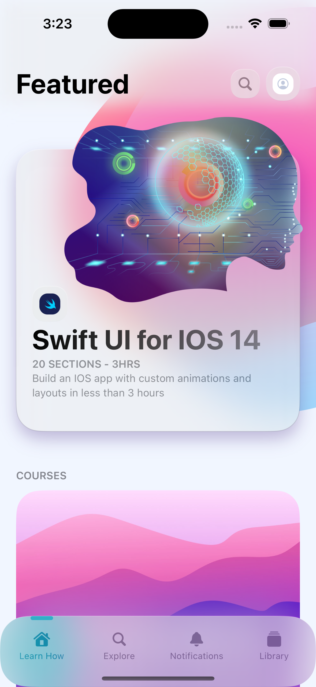
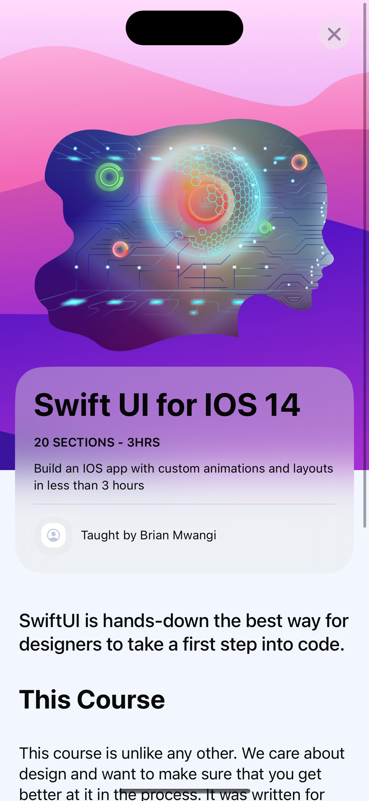
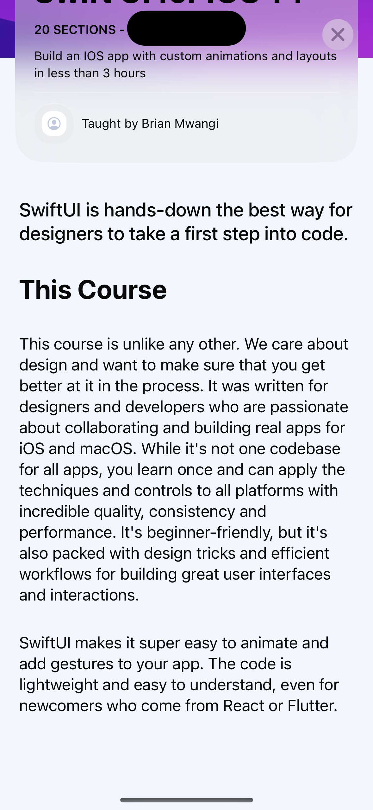
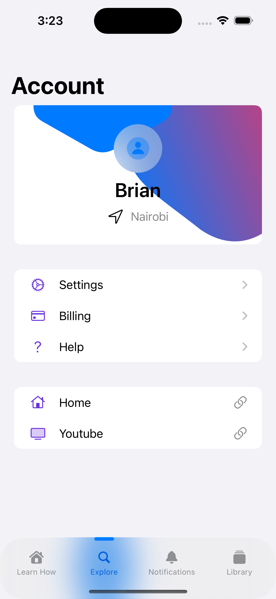

## Qlick
Qlick is an iOS application that shows awesome animations and custom views such as the custom navbar. Its my start of learning how to build iOS applications.
you can view the screenshots of how the app looks like there

## Tools
I built the app using the latest xCode version it does not have any dependencies whatsoever

## Screenshots.
You can view how the app looks like.

  
   
    
     

